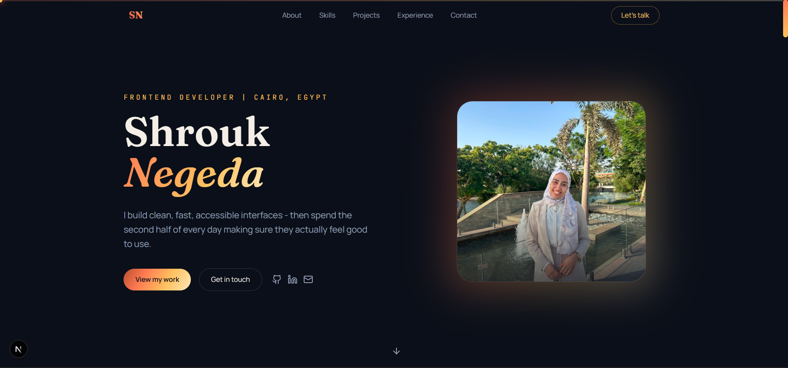
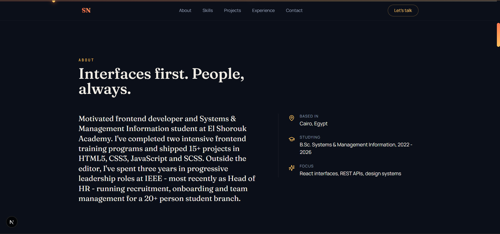
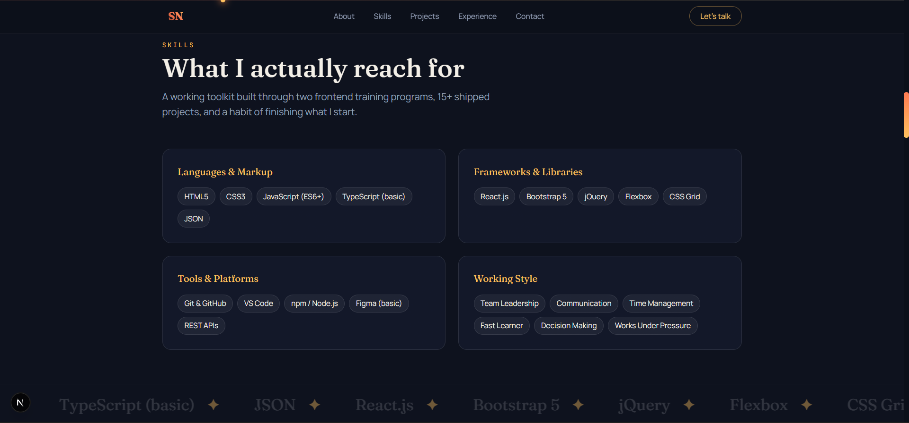
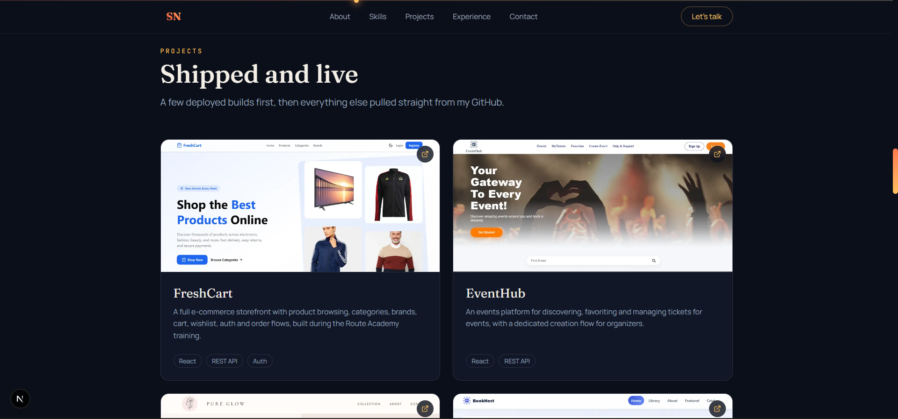
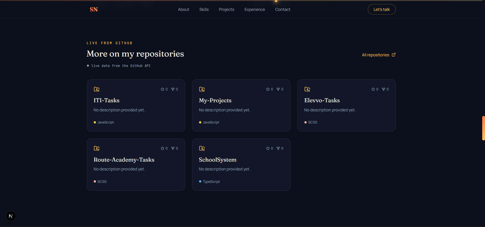
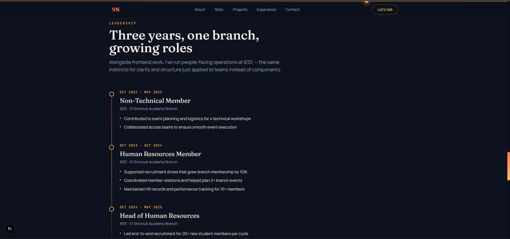
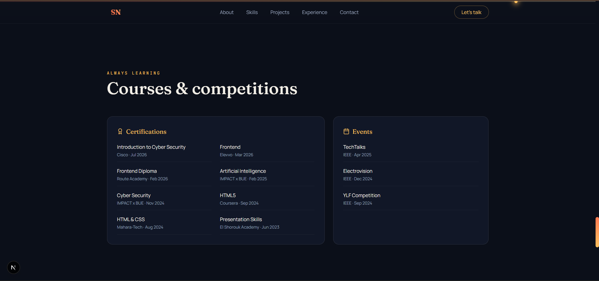
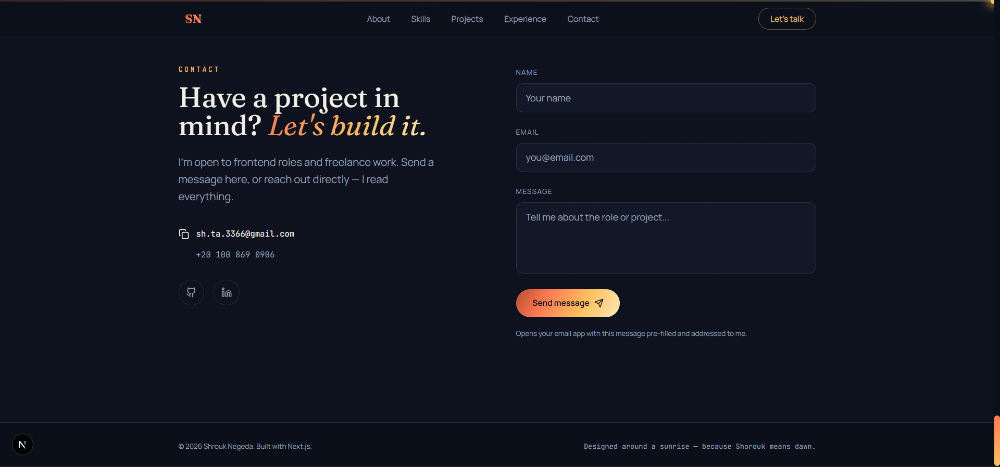

# Shrouk Negeda — Portfolio

A professional personal portfolio built with **Next.js 16**, **Tailwind CSS**, and **Framer Motion**.

## Live Demo

[shrouk-negeda-portfolio.vercel.app](https://your-vercel-link-here.vercel.app)

## Preview

| | |
|---|---|
|  |  |
|  |  |
|  |  |
|  |  |

## Signature Concept

"Shorouk" is Arabic for *sunrise*, so the whole design is built around that idea:
- A scroll-progress bar at the top of the page (`SunProgress`) rendered as a small sun that moves and shifts color from deep coral to gold as you scroll down.
- A recurring "dawn gradient" (coral → gold) used across buttons and headings.
- A horizon line in the Hero section that draws itself in with an animation on page load.

## Tech Stack

- **Next.js 16.1.4** (App Router)
- **React 19**
- **Tailwind CSS** — all design tokens (colors, fonts) are defined in `tailwind.config.js`
- **Framer Motion** — every animation (reveal text, scroll progress, hover effects)
- **lucide-react** — icons
- **GitHub REST API** — the Projects section fetches your repositories **live** from GitHub (`api.github.com/users/ShroukNegeda/repos`), no API key required

## Run it locally

```bash
npm install
npm run dev
```

Open `http://localhost:3000`

## Build for production

```bash
npm run build
npm start
```

## Project structure

```
app/
  layout.jsx        -> fonts and metadata
  page.jsx           -> the home page (assembles all sections)
  globals.css         -> Tailwind + global animation styles
components/
  Navbar.jsx
  Hero.jsx
  About.jsx
  Skills.jsx
  Projects.jsx         -> fetches projects from the GitHub API
  Experience.jsx
  Courses.jsx
  Contact.jsx
  Footer.jsx
  SunProgress.jsx       -> the signature element
  RevealText.jsx         -> text reveal animation
  FadeIn.jsx
  SpotlightCard.jsx       -> project cards with a cursor-follow glow
lib/
  data.js                 -> all my content (bio, skills, experience...) in one place
public/images/
  shrouk.jpg               -> my profile photo
```

## Editing your content

All the content (name, bio, skills, experience, courses) lives in a single file:
```
lib/data.js
```
You can edit it directly without touching any component.

## My photo

```
public/images/shrouk.jpg
```

## Contact section

The form currently opens the visitor's email app (`mailto:`) with a pre-filled message — no backend or API key needed.
If you'd like messages to reach you without the visitor opening an email app (a true form submission), you can wire it up to a service like:
- [Web3Forms](https://web3forms.com) (free, just needs an access key)
- [EmailJS](https://www.emailjs.com)


## Deployment

The project is ready to deploy on **Vercel** directly (the same platform your other projects are already on):
```bash
npm install -g vercel
vercel
```